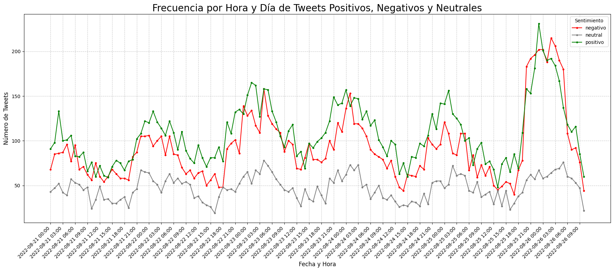
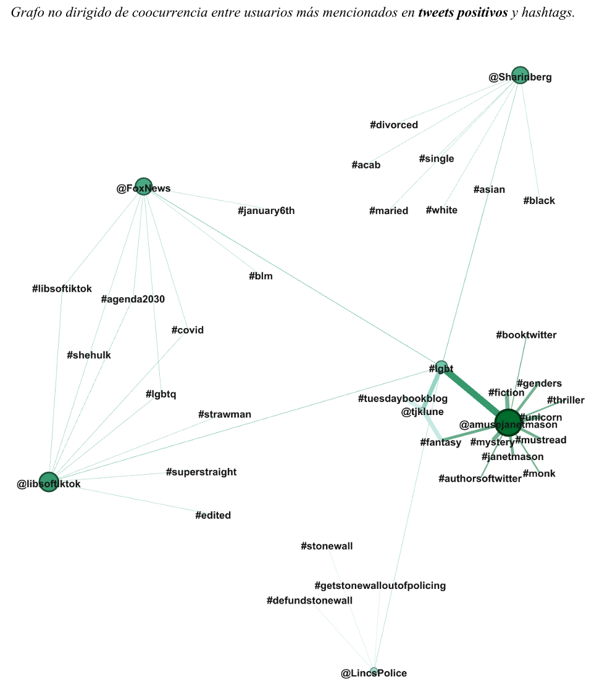
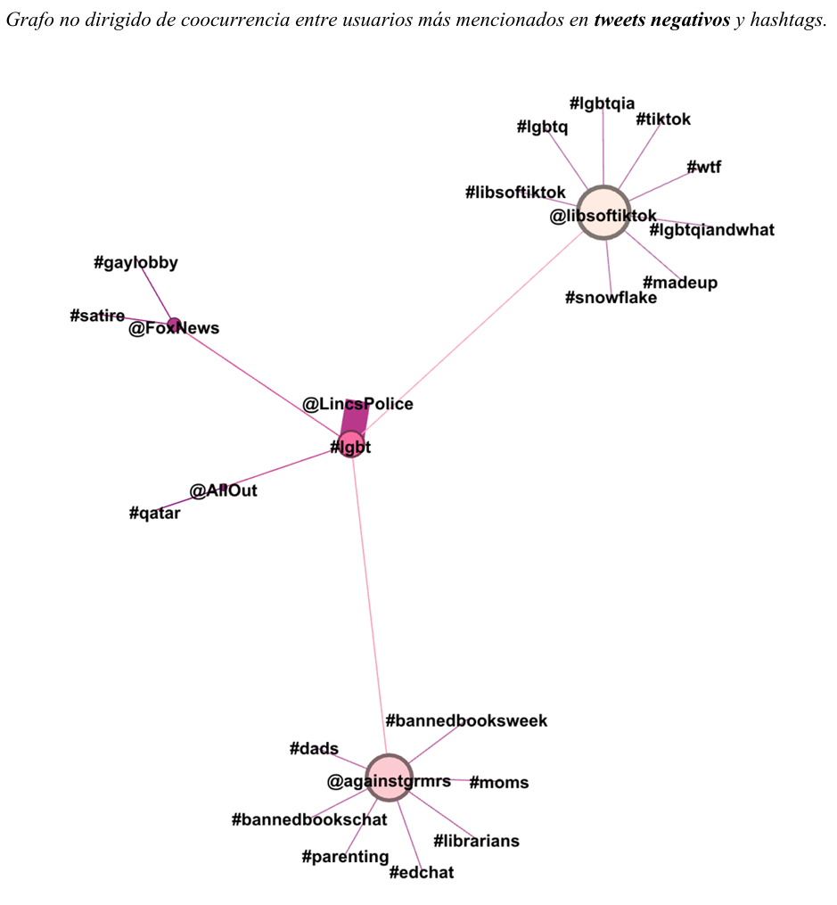

# Social Media Sentiment and Network Analysis

## Project Overview

This project combines Natural Language Processing (NLP) and Network Analysis to investigate sentiment patterns and semantic interaction structures in Twitter discussions related to LGBT topics.

Using a dataset of 32,456 English-language tweets collected between August 21 and August 26, 2022, the study applies sentiment analysis with VADER (Valence Aware Dictionary and sEntiment Reasoner) and constructs semantic co-occurrence networks based on user mentions and hashtags. The resulting networks are visualized and analyzed using Gephi.

The objective is to identify how positive and negative conversations differ in terms of sentiment distribution, user interactions, and semantic structures.

---

## Research Question

How do sentiment patterns and semantic co-occurrence networks emerge in Twitter discussions related to LGBT topics?

---

## Dataset

Source:

* LGBT Tweets Dataset (Kaggle)
* Author: vencerlanz09
* License: Public Domain

Dataset characteristics:

* 32,456 tweets
* English language
* Period: August 21–26, 2022
* Variables include:

  * Tweet text
  * Date and time
  * User identifier
  * Replies
  * Likes
  * Retweets

---

## Methodology

The project consists of four main stages:

### 1. Data Preprocessing

* Data type transformation
* Missing value verification
* URL removal
* Removal of special characters
* Removal of user mentions
* Removal of numbers
* Text normalization

### 2. Sentiment Analysis

Sentiment classification was performed using VADER, a lexicon and rule-based sentiment analysis tool specifically designed for social media texts.

Tweets were classified into:

* Positive
* Neutral
* Negative

Using the standard VADER compound score thresholds:

* Positive ≥ 0.05
* Negative ≤ -0.05
* Neutral otherwise

### 3. Semantic Co-occurrence Network Construction

Mentions and hashtags were extracted from tweets and transformed into co-occurrence networks.

Separate networks were generated for:

* Positive tweets
* Negative tweets

Node and edge tables were exported for further analysis.

### 4. Network Visualization and Analysis

Networks were visualized in Gephi using the ForceAtlas layout algorithm.

Network properties analyzed include:

* Degree centrality
* Density
* Diameter
* Connectivity patterns
* Bridge nodes

---

## Results

### Sentiment Distribution

The sentiment analysis produced the following distribution:

| Sentiment | Percentage |
|---|---:|
| Positive | 43.7% |
| Negative | 37.2% |
| Neutral | 19.1% |

Positive tweets slightly outnumbered negative tweets, although both categories remained relatively balanced throughout the observation period.

### Temporal Dynamics

The analysis revealed clear temporal patterns in tweet activity, with higher posting frequencies occurring during late-night and early-morning hours.

The sentiment timeline shows continuous interaction between positive and negative discourse over the analyzed period.

### Semantic Networks

Two semantic co-occurrence networks were generated:

#### Positive Network

* 39 nodes
* 44 edges
* Density: 0.059
* Diameter: 4

The network is characterized by strong connections among LGBT-related authors, activists, and media accounts.

#### Negative Network

* 24 nodes
* 23 edges
* Density: 0.083
* Diameter: 4

The network contains stronger associations with culture-war, education, and political discussion topics.

---

## Visualizations

### Sentiment Timeline



### Positive Semantic Network



### Negative Semantic Network



---

## Key Findings

* Positive tweets represented the largest sentiment category.
* VADER performs well on highly emotional tweets but struggles with context-dependent and politically nuanced messages.
* Semantic networks reveal distinct communities and interaction structures between positive and negative discourse.
* The hashtag #lgbt acts as a bridge node connecting otherwise disconnected components in both networks.
* Network analysis provides additional insights beyond sentiment classification alone.

---

## Technologies Used

* Python
* Pandas
* Matplotlib
* VADER Sentiment
* Regular Expressions (Regex)
* Gephi
* Network Analysis

---

## Repository Structure

```text
social-media-sentiment-network-analysis/

├── README.md
├── requirements.txt
├── Sentiment_and_Network_Analysis_about_LGBTIQ_Tweets.ipynb

├── data/
│   ├── lgbt_tweets.csv
│   └── README.md

├── network_data/
│   ├── positive_nodes.csv
│   ├── positive_edges.csv
│   ├── negative_nodes.csv
│   └── negative_edges.csv

├── gephi/
│   ├── positive_network.gephi
│   └── negative_network.gephi

└── images/
    ├── sentiment_timeline.png
    ├── positive_network.png
    └── negative_network.png
```

---

## How to Reproduce

1. Clone the repository.
2. Install dependencies:

```bash
pip install -r requirements.txt
```

3. Open the notebook:

```bash
Sentiment_and_Network_Analysis_about_LGBTIQ_Tweets.ipynb
```

4. Run all cells to reproduce:

   * Sentiment analysis
   * Temporal analysis
   * Node and edge generation

5. Open the Gephi project files to explore the semantic networks interactively.

---

## Author

Carlos F. Carreras De León

MSc in Social Data Science

University of Granada
